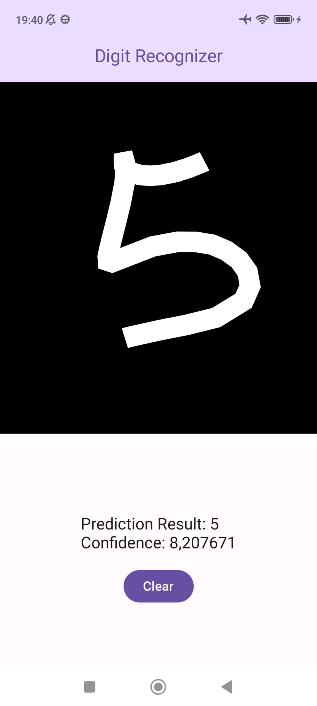

# DigitRecognition Android App

## Overview

**DigitRecognition** is an Android app that recognizes digits drawn on a canvas using a custom model trained on the MNIST dataset with TensorFlow Lite. The app allows users to draw digits, and the model will accurately predict and display the corresponding number.

